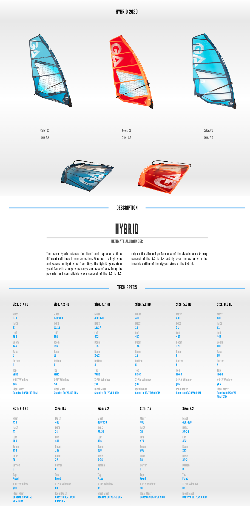
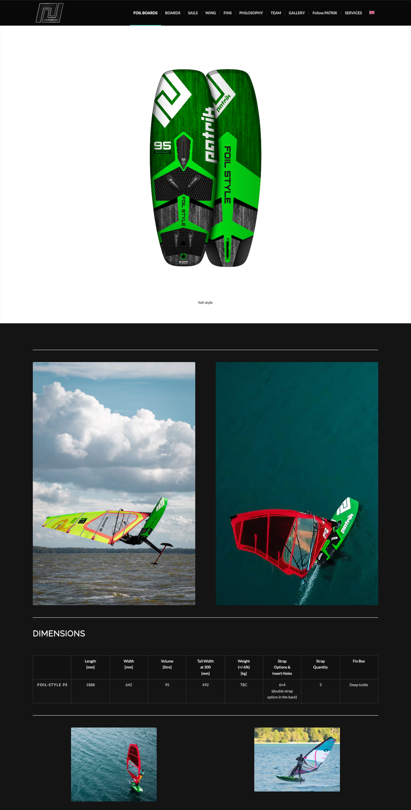

# watersport-catalog

This library's goal is to **document all available information about water sports gear**:

- windsurfing boards and sails
- kitesurfing boards and kites
- wingfoil boards and wings
- ... more to come

<details>
  <summary>Brands currently supported</summary>

- [Gaastra](https://ga-windsurfing.com/)
- [Exocet](https://www.exocet-original.fr/)
- [Patrik](https://patrik-windsurf.com/)
- [Point-7](https://point-7.com/)
- [Fanatic](https://www.fanatic.com/fr/windsurfing)

</details>

This means turning human-readable websites such as:




...into **machine-readable** code like:

```json
{
  "dimensions": ["color", "size"],
  "brandName": "Gaastra",
  "year": 2020,
  "name": "Hybrid",
  "type": "sail",
  "infoUrl": "https://ga-windsurfing.com/sails/2020/freeride/hybrid-20",
  "activities": ["windsurf", "windfoil"],
  "programs": ["freeride"],
  "variants": [
    {
      "variant": {
        "size": 3.7
      },
      "surfaceM2": 3.7,
      "mastLengthsCm": [370],
      "mastIMCS": [17],
      "mastExtensionLengthsCm": [0],
      "luffLengthCm": 365,
      "boomLengthCm": 146,
      "battenCount": 4,
      "topType": "vario"
    },
    {
      "variant": {
        "size": 4.2
      },
      "surfaceM2": 4.2,
      "mastLengthsCm": [370, 400],
      "mastIMCS": [17, 19],
      "mastExtensionLengthsCm": [16],
      "luffLengthCm": 386,
      "boomLengthCm": 156,
      "battenCount": 4,
      "topType": "vario"
    },
```

## TL;DR

- Find gear description in [data](./data) directory
- Read about the data model in [product.ts](src/model/product.ts)

## Description

The library

- defines a **common model** to describe gear
- scrapes information from brands' websites
- generates JSON files representing gear that has been "scrapped"
- gear can also be _manually defined_

This project contains both the code to scrape information (in `src`)
and the latest catalog information in JSON format (in `products`).

The **product definition** is described in details in [product.ts](src/model/product.ts)

### Use gear information

Data is in JSON format available in the [data](./data) directory

The project can be imported in other projects to use both data and data model:

```shell
# In your own project
npm install watersport-catalog
```

### Contribute

To contribute to this wonderful "wikipedia of water sport products":

- clone the project
```shell
git clone git@github.com:OlivierChirouze/watersport-catalog.git
```

- install
```shell
cd watersport-catalog
npm install
```

- in [src](./src)
  - create a new scrapper for brand or update an existing one
  - the "scrapper" can either read from a brand's website, or use handmade files

- run
  - create a new "generate:xxx" npm script in [package.json](package.json) if needed
  - run it, example:
```shell
npm run generate:patrik
```
